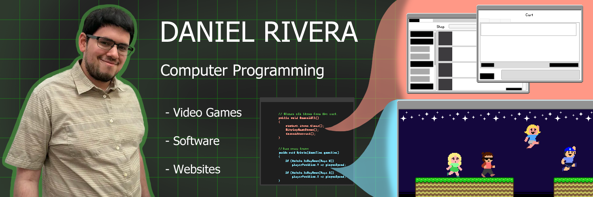
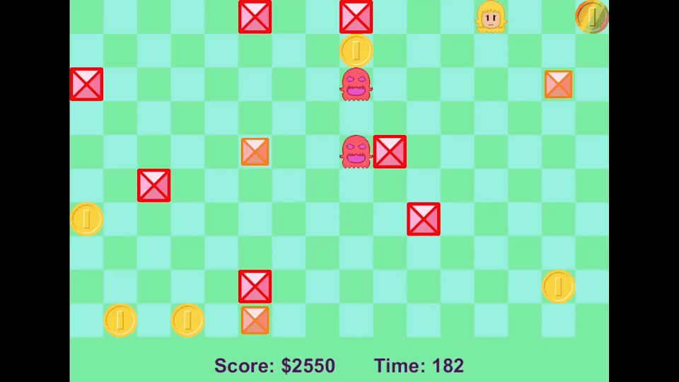

   

# Hello!
My name is Daniel Rivera. I aspire to become a video game developer using the coding skills obtained from my time at Texas State Technical College. 
I also have experience developing software (in Windows Forms) and websites, and am open to positions involving the creation of either. 
 
I hold an Associate's Degree in Computer Programming Technology.
- Creative
- Passionate
- Great attention to detail
- Loves to code

## Stats

## Works

#### College projects:
- Money Map Mayhem (Java game)

- Fuzzy Zebra Toy Supplies (C# Winforms application)

- Family Pets (Mockup Website)

## About Me
I love coding. I have always loved it, even before knowing what it was. My childhood is full of moments when I’d create games with paper, toys, and the rooms of my house. It wasn’t just roleplay; the games had to involve logic and variables, rules and structure, a way to win and a way to lose. Out of all these aspects, logic was the most important for making those games fun. Today, coding allows me to experience that same logic I adore. 

I see video games as works of art, capable of sparking emotions and inspiration within those who play. And like any form of art, you can look at all the pieces individually to find out why it’s so engaging and memorable. For games, the pieces are gameplay, visuals, and music. My biggest focus is on the gameplay. I aim to make games fun and responsive, finely tuning the code to ensure it doesn’t feel frustrating to do even the simplest things.

## Contact
<b>Email: iriveradaniel30@gmail.com</b> 
<b>GitHub Page: [Portfolio Website](https://dirivera127843.github.io/)</b>
